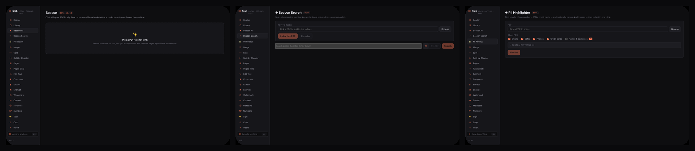
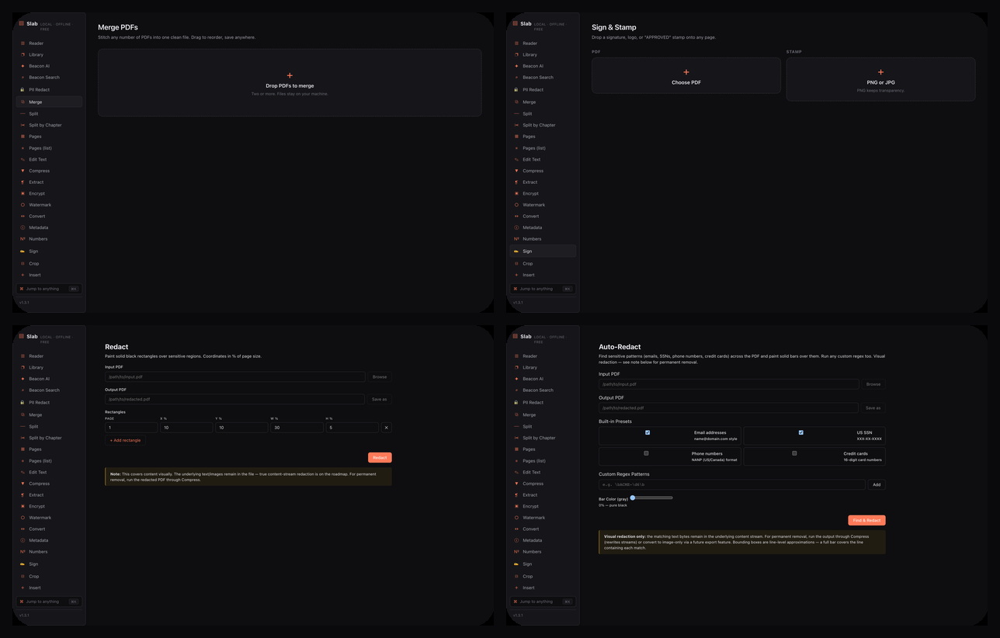
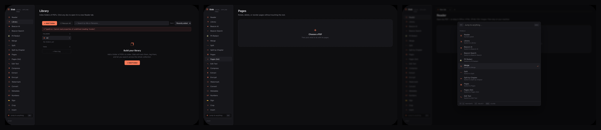
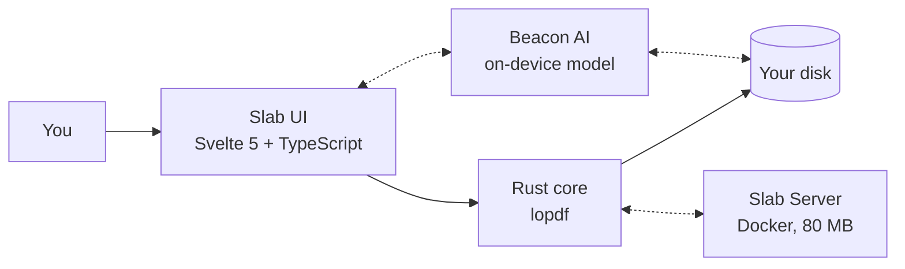

<div align="center">

# Slab 🍰

**The PDF toolkit your files never leave.**

A fast, free, fully offline PDF studio for macOS, Windows, and Linux —
with on-device AI, watched-folder automation, and a self-hostable Docker server.

[](https://github.com/Sanjays2402/slab/actions/workflows/build.yml)
[](LICENSE)
[](https://github.com/Sanjays2402/slab/releases/latest)


**[Download Slab](https://github.com/Sanjays2402/slab/releases/latest)** ·
[Website](https://sanjays2402.github.io/slab/) ·
[Report an issue](https://github.com/Sanjays2402/slab/issues)

</div>

---

## Why Slab

| | |
|---|---|
| 🔒 **Local-first** | Your documents never touch a server. Air-gap a laptop and Slab still works — AI included. |
| ⚡ **Fast** | Native Rust core. A hundred-file merge finishes before your coffee does. |
| 🪶 **Tiny** | ~15–25 MB installers. No Electron bloat. |
| 💸 **Honest** | Free forever, GPL-3.0. No accounts, no telemetry, no "Pro" tier. |

## Take the tour

**Beacon — AI that can't reach the internet.** Chat with citations, semantic search across your library, one-click PII redaction, summaries, study flashcards, glossary, voice — all on-device. Ollama by default; any OpenAI-compatible endpoint is a config away.



**The everyday craft.** Merge a hundred files in a second. Drop a signature or an `APPROVED` stamp on any page. Burn redactions into the content stream. OCR a scanned stack into searchable text.



**Find anything, instantly.** A browsable library across every PDF you've imported, line-level diff between any two documents, and one `⌘K` palette to reach all 65 tools.



## Hopper — folders that file themselves

Point Hopper at a folder — `~/Downloads`, a scanner, a shared inbox — and attach a recipe. New PDFs get flattened, OCR'd, redacted, watermarked, renamed by Beacon, and filed away, with a live log streaming every run.

Six predicate kinds route each file (filename, regex, text contents, page count, size, catch-all), and a live preview pane shows what each rule would catch against your *actual* recent files. `⇧⌘H` to open it.

Hazel charges $42 and can't read PDFs. Adobe's automation needs an enterprise license and phones home. Hopper is free and local.

## Slab Server — the same engine, in 80 megabytes

Headless Slab: an HTTP API plus a drag-and-drop web UI in a single Docker image. Put it on your NAS, script it, hide it behind a reverse proxy.

```bash
docker run --rm -p 8080:8080 ghcr.io/sanjays2402/slab:latest
```

Open [http://localhost:8080](http://localhost:8080), drop a PDF on the page. Full API + Compose example: [docs/server.md](docs/server.md).

## 65 tools, one palette

<details>
<summary><strong>See every tool</strong> — press <kbd>⌘K</kbd> anywhere in the app to jump to any of them</summary>

| Group | Tools |
|---|---|
| Read & organize | Reader · Library · Search Library · Pages · Pages (list) · Slides · Theater |
| Assemble | Merge · Split · Split by Chapter · Insert · N-up · Flatten · Bind (PDF → EPUB) |
| Convert | Convert · Reflow (PDF → Word) · Tabulate (PDF → Excel) · Markdown (PDF → MD/HTML) · Markdown → PDF · Compress · Compact · Streamline (Fast Web View) · Archive (PDF/A) · Press (PDF/X-4) · Grayscale |
| Edit | Edit Text · Crop · Watermark · Header/Footer · Page Labels · Numbers · Bates · Legal Stamp · Metadata |
| Protect | Encrypt · Redact · Auto-Redact · Veil · Sanitize · Sign · Signet · Batch Sign |
| Analyze | OCR · Extract · Tables → CSV · Diff · Compare · Compare 3-way · Repair |
| Beacon AI | Beacon AI · Beacon Search · PII Redact · Citations · Study · Glossary · Voice |
| Automate | Hopper (Watched Folders) · Atelier (Recipes) · Quill Batch · Quill Designer · Quill Auto-Detect |
| Create | Forms · Toolbox · Loom (PDF/UA) · Loupe (PDF/A check) |

</details>

## Also in the box

- **Standalone CLI** — a separate `slab` binary ships in every bundle: `slab autoredact in.pdf out.pdf --preset email,ssn`, no GUI needed.
- **Polyglot** — point Slab at `.docx` `.xlsx` `.pptx` `.epub` `.csv` `.json` `.html` `.rtf` `.odt`, images (EXIF + OCR text), even audio (EXIF + transcription) and get PDFs out.
- **Detachable panels** — pop any panel into its own window. Beacon on the second monitor, two Readers side by side.
- **Vim mode** — modal keybindings (`gg`/`G`/`j`/`k`, counts, `/` search, `:42`) in Reader, Library, and Beacon.
- **A11y & i18n** — built-in accessibility audit, full keyboard control, and a JSON locale system.

## Install

Pre-built installers ship with every [release](https://github.com/Sanjays2402/slab/releases):

| Platform | Files |
|---|---|
| macOS (Apple Silicon + Intel) | `.dmg` |
| Windows | `.msi` + `.exe` |
| Linux | `.deb` + `.AppImage` + `.rpm` |

**First launch on macOS:** the builds are ad-hoc signed (no $99/year Apple Developer ID yet), so Gatekeeper warns once. Right-click **Slab.app** → **Open** → **Open** in the dialog. Every launch after is a normal double-click. Verify the signature yourself with `codesign -dvv /Applications/Slab.app`. To help fund a Developer ID so this prompt goes away for everyone, see [SIGNING.md](SIGNING.md).

## Build from source

Prereqs: Rust ≥ 1.75, Node ≥ 20, pnpm ≥ 9.

```bash
git clone https://github.com/Sanjays2402/slab
cd slab
pnpm install
pnpm tauri dev          # run in dev mode
pnpm tauri build        # installer / app bundle for your platform
```

Optional runtime deps for the AI side: [Ollama](https://ollama.com) + `ollama pull llama3.2:3b` for Beacon chat; `whisper-cpp` for voice dictation. The settings panel tells you exactly what's missing.

```bash
cd src-tauri && cargo test
cargo clippy --all-targets -- -D warnings
```

## Under the hood



Tauri 2 shell, Svelte 5 front-end, pure-Rust PDF core (`lopdf`), `pdfjs-dist` rendering, Tesseract OCR, local embeddings + on-device chat for Beacon. 730+ Rust tests, clippy-clean, cross-platform CI.

## A small promise

Slab will never ask for an email. Will never call home. Will never gate a feature behind a paywall. If it ever does any of those things, you have my permission to fork it and rip the offending lines out.

Made with 🍰 by [@Sanjays2402](https://github.com/Sanjays2402).